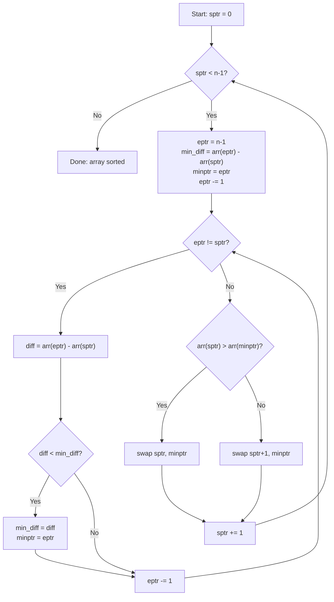
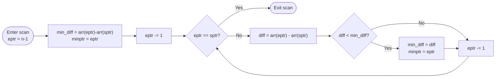
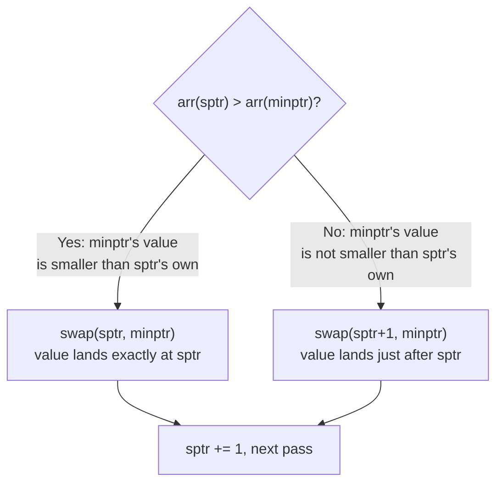
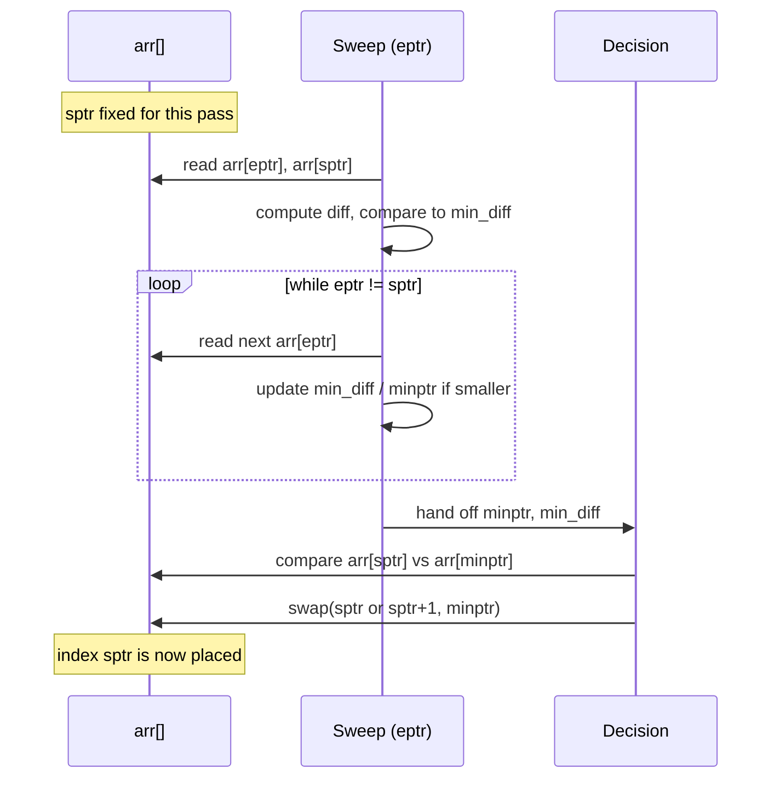
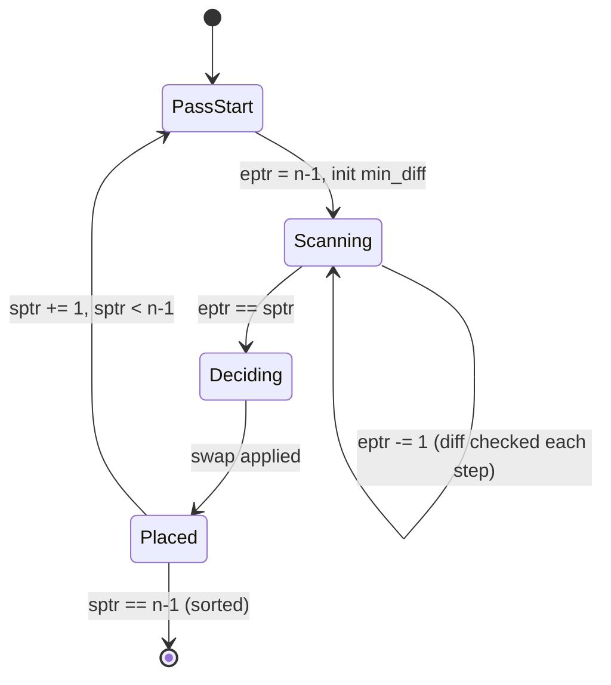
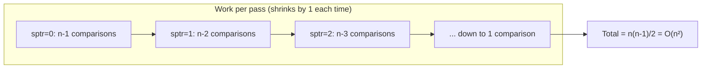

# Custom Two-Pointer Selection Sort

A selection-sort variant that uses a **two-pointer sweep** (`sptr`, `eptr`)
on each pass to find the element with the smallest *signed difference*
relative to `sptr`, then places it correctly.

**Live visualizer:** open [`visualiser.html`](./visualiser.html) in a browser to watch
the algorithm sort step-by-step, with `sptr`, `eptr`, and `minptr` highlighted
on animated bars.

---

## 1. How it works

For each position `sptr` (from `0` to `n-2`):

1. Start `eptr` at the **last index** of the array.
2. Sweep `eptr` backward toward `sptr`, tracking:
   - `min_diff = arr[eptr] - arr[sptr]` (smallest signed difference seen)
   - `minptr` = the index where that minimum occurred
3. Once `eptr == sptr`, the sweep ends.
4. Decide how to place the found element:
   - If `arr[sptr] > arr[minptr]` → **swap `sptr` and `minptr` directly**
     (the found value is smaller than `sptr`'s own value, so it belongs at `sptr`).
   - Else → **swap `sptr+1` and `minptr`**
     (place it right after `sptr`).
5. Advance `sptr` by 1 and repeat.

This mimics selection sort's "find the right value, place it" strategy,
but the *search rule* is "most negative difference from `arr[sptr]`"
instead of a plain minimum search, and the *placement rule* depends on
whether that value is smaller than `arr[sptr]` itself.

---

## 2. Pass-by-pass diagram

Example array: `[5, 2, 9, 1, 7]`

```
Pass 1: sptr=0
[ 5,  2,  9,  1,  7]
  ^sptr           ^eptr
scan eptr backward, comparing arr[eptr]-arr[sptr]:
   7-5=2   -> min_diff=2,  minptr=4
   1-5=-4  -> min_diff=-4, minptr=3   (new min)
   9-5=4   -> no change
   2-5=-3  -> no change (not < -4)
eptr reaches sptr, sweep ends.
arr[sptr]=5 > arr[minptr]=1  -> swap sptr & minptr directly
[ 1,  2,  9,  5,  7]

Pass 2: sptr=1
[ 1,  2,  9,  5,  7]
      ^sptr        ^eptr
scan: 7-2=5, 5-2=3, 9-2=7 -> min_diff=3, minptr=3
arr[sptr]=2 < arr[minptr]=5 -> swap sptr+1 & minptr (no-op, already adjacent)
[ 1,  2,  9,  5,  7]

Pass 3: sptr=2
[ 1,  2,  9,  5,  7]
          ^sptr    ^eptr
scan: 7-9=-2, 5-9=-4 -> min_diff=-4, minptr=3
arr[sptr]=9 > arr[minptr]=5 -> swap sptr & minptr directly
[ 1,  2,  5,  9,  7]

Pass 4: sptr=3
[ 1,  2,  5,  9,  7]
              ^sptr^eptr
scan: 7-9=-2 -> min_diff=-2, minptr=4
arr[sptr]=9 > arr[minptr]=7 -> swap sptr & minptr directly
[ 1,  2,  5,  7,  9]

Done. Sorted: [1, 2, 5, 7, 9]
```

### 2a. Main control flow



### 2b. Inner scan loop, isolated



### 2c. Placement decision



### 2d. Per-pass sequence (state across one full pass)



### 2e. Full sort as nested-loop state machine



### ASCII version (if Mermaid isn't rendered by your viewer)

```
        ┌───────────────────────────┐
        │ sptr = 0                  │
        └────────────┬──────────────┘
                      ▼
        ┌───────────────────────────┐
   ┌───▶│ eptr = n-1                │
   │    │ min_diff = arr[eptr]-arr[sptr]
   │    │ minptr = eptr             │
   │    └────────────┬──────────────┘
   │                 ▼
   │    ┌───────────────────────────┐
   │    │ eptr -= 1                 │
   │    │ while eptr != sptr:       │
   │    │   diff = arr[eptr]-arr[sptr]
   │    │   if diff < min_diff:     │
   │    │     min_diff, minptr = diff, eptr
   │    │   eptr -= 1               │
   │    └────────────┬──────────────┘
   │                 ▼
   │    ┌───────────────────────────┐
   │    │ arr[sptr] > arr[minptr]?  │
   │    │  yes → swap(sptr, minptr) │
   │    │  no  → swap(sptr+1,minptr)│
   │    └────────────┬──────────────┘
   │                 ▼
   │    ┌───────────────────────────┐
   │    │ sptr += 1                 │
   │    │ sptr < n-1 ?  ── yes ─────┘
   │    └────────────┬──────────────┘
   │                 │ no
   │                 ▼
   │            ┌─────────┐
   └────────────│  Done   │
                └─────────┘
```

---

## 3. Time Complexity

| Case      | Complexity  | Reason |
|-----------|-------------|--------|
| Best case | `O(n²)`     | The inner sweep always runs regardless of input order — no early exit exists. |
| Average   | `O(n²)`     | Same — every pass scans the remaining unsorted suffix. |
| Worst case| `O(n²)`     | Same. |

**Why `O(n²)`:** the outer loop runs `n-1` times (`sptr` from `0` to `n-2`).
For each `sptr`, the inner `eptr` sweep runs `~(n - sptr - 1)` times.
Summing: `(n-1) + (n-2) + ... + 1 = n(n-1)/2`, which is `O(n²)`.



This places it in the same complexity class as **selection sort**,
**bubble sort**, and **insertion sort** — it does not achieve the
`O(n log n)` of merge sort / quicksort / heapsort, because each pass
only guarantees one element is correctly placed.

---

## 4. Space Complexity

- **`O(1)` auxiliary space** — sorting is done **in-place**.
- Only a constant number of extra variables are used (`sptr`, `eptr`,
  `min_diff`, `minptr`, `nxt`), regardless of `n`.
- No recursion, no extra arrays/lists are allocated.

---

## 5. Stability

**Not stable.** Because elements are swapped across arbitrary distances
(not just adjacent elements), equal-valued elements can have their
relative order changed. Example: `[4, -1, 4, 0, 9, -3]`'s two `4`s
may end up in either relative order depending on how swaps land.

---

## 6. Summary Table

| Property          | Value                          |
|--------------------|---------------------------------|
| Time (best)        | O(n²)                          |
| Time (average)     | O(n²)                          |
| Time (worst)       | O(n²)                          |
| Space              | O(1)                           |
| In-place           | Yes                             |
| Stable             | No                               |
| Adaptive           | No (no early exit on sorted input) |
| Comparison-based   | Yes                             |

---

## 7. Limitations

1. **No asymptotic improvement** — still `O(n²)` in best/average/worst cases, same as plain selection sort. The extra pointer doesn't buy any speed.
2. **Extra arithmetic overhead** — computing a signed difference (subtraction) per comparison instead of a direct `<` check adds constant-factor overhead versus standard selection sort.
3. **Not stable** — long-distance swaps can reorder equal elements relative to each other.
4. **Not adaptive** — no early exit for already-sorted input; always does the full `O(n²)` work.
5. **Not online** — requires the whole array upfront; can't sort a growing stream incrementally.
6. **Two-branch placement logic adds complexity without benefit** — the `if arr[sptr] > arr[minptr] ... else ...` split is logically equivalent to a single unconditional swap (as in standard selection sort) but harder to read and verify.
7. **Doesn't scale** — impractical for large `n` (thousands+) compared to `O(n log n)` algorithms (merge sort, quicksort, heapsort, Timsort).
8. **No practical advantage over standard selection sort** — same write count, same comparison count, same complexity class. Its value is conceptual/educational rather than performance-driven.

---

## 8. Making It More Efficient

The current version is functionally equivalent to selection sort, so genuine efficiency gains mean either **simplifying it down to true selection sort speed** (removing wasted work) or **moving to a fundamentally faster algorithm family**. Options, roughly in order of effort:

### A. Cheap fixes (still O(n²), but less wasted work)
- **Drop the signed-difference arithmetic.** Since `diff < min_diff` reduces to comparing `arr[eptr]` and `arr[sptr] + min_diff`, you can track the minimum **value** directly (`if arr[eptr] < min_val: min_val, minptr = arr[eptr], eptr`) instead of computing a subtraction every time. Same result, fewer operations per comparison.
- **Collapse the two-branch swap into one.** The `if arr[sptr] > arr[minptr] ... else ...` split does the same job as selection sort's single `if minptr != sptr: swap(sptr, minptr)`. Removing the branch removes redundant logic without changing behavior.
- **Add an adaptive early exit.** Track whether any swap happened in a full pass; if a pass makes zero swaps, the array is already sorted and you can `break` early. This helps on nearly-sorted input (best case becomes closer to `O(n)`), similar to how bubble sort optimizes.
- **Make it stable (optional).** Instead of one long-distance swap, shift elements one-by-one from `minptr` back to `sptr` (like insertion). This preserves relative order of equal elements, at the cost of more writes (`O(n)` moves per pass instead of `O(1)`).

### B. Real asymptotic improvement (change algorithm family)
If you actually need better than `O(n²)`, the two-pointer *idea* doesn't extend to sub-quadratic sorting — you'd move to a different technique entirely:
- **Merge Sort** — `O(n log n)` guaranteed, stable, but needs `O(n)` extra space.
- **Heap Sort** — `O(n log n)` guaranteed, in-place (`O(1)` space), not stable — closest in spirit to selection sort (also "repeatedly extract the minimum/maximum"), but uses a heap instead of a linear scan, cutting the extraction cost from `O(n)` to `O(log n)`.
- **Quicksort** — `O(n log n)` average (worst case `O(n²)`), in-place, very fast in practice due to cache-friendly access patterns.
- **Insertion Sort** — still `O(n²)` worst case, but genuinely adaptive/fast (`O(n)`) on nearly-sorted data — worth it only if your data is usually close to sorted already.

**Practical takeaway:** if you want to keep your two-pointer *design* but make it faster, apply the type-A fixes above (they reduce constant-factor overhead and can add adaptiveness). If you want genuine `O(n log n)` performance, heap sort is the natural next step since it generalizes the "repeatedly select the extreme element" idea you're already using, just with a heap instead of a linear scan.

---

## 9. Code

Reference implementations, one file per language:

| Language | File |
|----------|------|
| Python   | [`custom_sort.py`](./custom_sort.py) |
| C        | [`custom_sort.c`](./custom_sort.c) |
| C++      | [`custom_sort.cpp`](./custom_sort.cpp) |
| Java     | [`CustomSort.java`](./CustomSort.java) |
| Rust     | [`custom_sort.rs`](./custom_sort.rs) |

All five implementations follow the exact same pointer logic described
above and produce identical traces on the example array.

---

## 10. Visualizer

[`index.html`](./index.html) is a self-contained, dependency-free page that
animates the algorithm bar-by-bar:

- **Load array** — type comma-separated numbers, or hit **Randomize**.
- **Step** — advance one micro-step at a time (each `eptr` move, each
  comparison, each swap is its own step).
- **Play / Pause** — auto-advance at an adjustable speed.
- Live readout of `sptr`, `eptr`, `minptr`, and the current `min_diff`,
  plus a plain-language narration line for every step.
- Color key: blue = `sptr`, teal = `eptr`, amber = `minptr`, green = placed.

Open it directly in any browser — no build step or server required.
